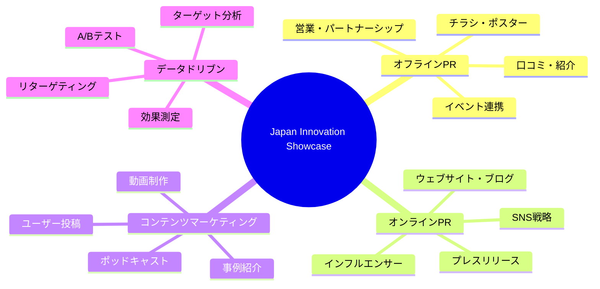
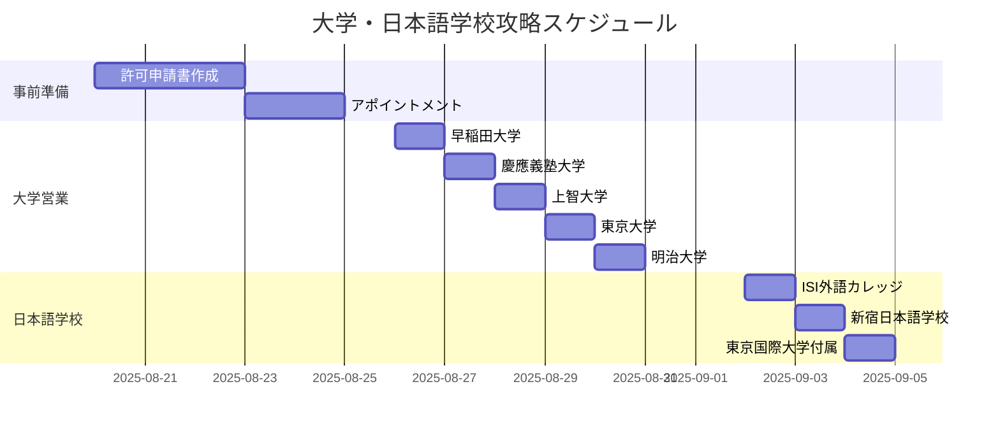
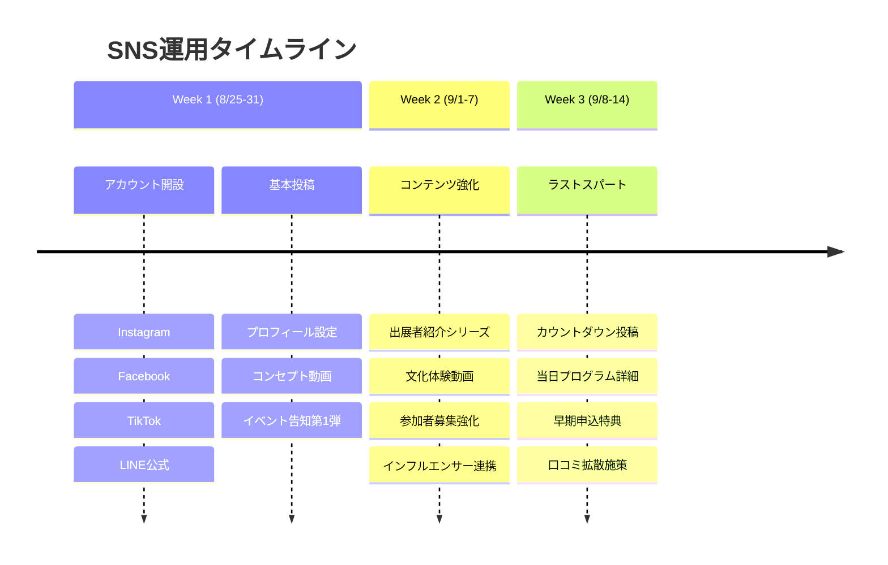
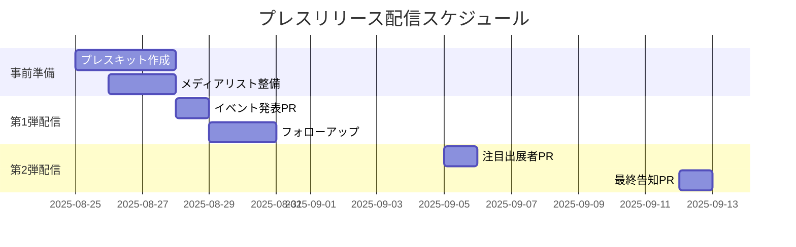
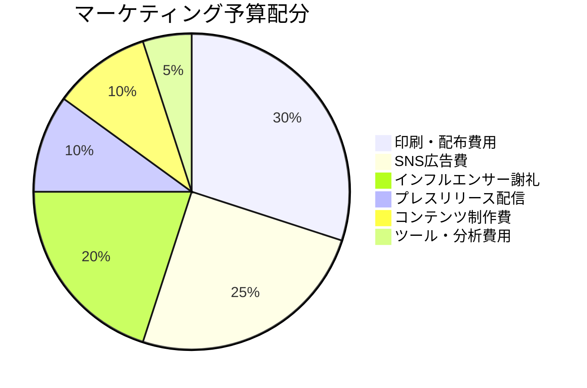

# PR戦略・マーケティング戦略

## 1. 統合マーケティング戦略概要

### 🌐 **Meetupグループ管理**
- **Global Friends Hub（第1層）**: [https://www.meetup.com/ja-JP/global-friends-hub/](https://www.meetup.com/ja-JP/global-friends-hub/)
- **Open Coral Network（第2層）**: [https://www.meetup.com/ja-JP/open-coral-network/](https://www.meetup.com/ja-JP/open-coral-network/)

## 2. チラシ・ポスター配布戦略

### **Phase 1: 高効果エリア集中攻略**

#### 外国人密集エリア（最優先）

| エリア | 施設 | 配布方法 | 期待効果 | 実施タイミング |
|--------|------|----------|----------|----------------|
| **渋谷・原宿** | スターバックス センター街店 WeWork 渋谷 TSUTAYA SHIBUYA | 店内ラック配布 掲示板貼付 レジ前配置 | 観光客・若者層 | 9月1-7日 |
| **新宿** | HUB新宿東口店 K's House Tokyo 多文化共生プラザ | バーカウンター ロビー配布 公式掲示 | 在住外国人 | 9月1-7日 |
| **六本木・麻布** | 六本木ヒルズライブラリー 外国人向け飲食店 各国大使館周辺 | 会員配布 レジ前設置 掲示板 | 駐在員・研究者 | 9月1-7日 |

#### 教育機関（効果的アプローチ）

**📋 詳細営業戦略**: [大学・センター営業戦略](./大学・センター営業戦略.md) 参照

| 大学名 | 担当部署 | アプローチ方法 | 配布場所 | 期待参加者数 |
|--------|----------|----------------|----------|--------------|
| 早稲田大学 | 国際コミュニティセンター | 正式申請→許可 | 国際部掲示板・ラウンジ | 3-5名 |
| 慶應義塾大学 | 国際センター | 学生団体経由 | 三田キャンパス学生部 | 2-4名 |
| 上智大学 | 国際関係本部 | 直接交渉 | 国際教養学部ラウンジ | 4-6名 |
| 東京大学 | 国際部 | 研究室紹介経由 | 本郷キャンパス国際部 | 2-3名 |

### **Phase 2: クリエイター・ビジネス層攻略**

#### コワーキングスペース戦略

| 施設名 | 月額会員特典活用 | 掲示方法 | ターゲット層 | コスト |
|--------|------------------|----------|--------------|--------|
| WeWork渋谷 | 会員向けイベント告知 | 専用掲示板 | 外資系・スタートアップ | 0円 |
| SPACES新宿 | コミュニティマネージャー経由 | ラウンジ配布 | フリーランス・起業家 | 0円 |
| CIC Tokyo | イノベーション系イベント連携 | 受付カウンター | テック系起業家 | 要相談 |

#### 起業・イノベーション拠点

- **STARTUP HUB TOKYO**: スタートアップ支援イベントとの連携
- **ファブカフェ渋谷**: クリエイター向けワークショップ告知
- **LODGE表参道**: デザイナー・アーティストネットワーク活用

## 3. デジタルマーケティング戦略

### **SNS統合戦略**

#### プラットフォーム別戦略

| Platform | 投稿頻度 | コンテンツタイプ | ハッシュタグ戦略 | 成果指標 |
|----------|----------|------------------|------------------|----------|
| **Instagram** | 週3回 | 写真+ストーリーズ リール動画 | #TokyoStartup #JapanInnovation #GlobalCreators #CultureFusion | フォロワー500名 投稿いいね平均50 |
| **TikTok** | 週2回 | 15-30秒動画 チャレンジ企画 | #JapanCulture #TokyoLife #Innovation #StartupTokyo | 動画再生10万回 フォロワー200名 |
| **Facebook** | 週2回 | イベント詳細 長文投稿 | グループ投稿中心 国際交流関連グループ | イベント参加表明15名 シェア50回 |
| **LINE** | 週1回 | 限定情報 申込リンク | 友だち登録特典 Push通知活用 | 友だち100名 開封率60% |

### **コンテンツカレンダー**

#### 週間テーマ設定
- **月曜**: Japan Culture Spotlight（日本文化紹介）
- **水曜**: Creator Feature（出展者・参加者紹介）
- **金曜**: Innovation Friday（技術・アイデア紹介）
- **日曜**: Community Voice（参加者の声・体験談）

#### バイラル狙いコンテンツ
1. **文化ギャップあるある動画**（TikTok）
2. **3分で学ぶ日本のイノベーション**（Instagram Reels）
3. **外国人が驚いた日本の○○**（全プラットフォーム）
4. **グローバル展開成功事例**（Facebook長文）

## 4. インフルエンサー・パートナーシップ戦略

### **Tier 1: マイクロインフルエンサー**

| カテゴリ | フォロワー数 | 報酬形態 | 期待効果 | アプローチ方法 |
|----------|-------------|----------|----------|----------------|
| 日本在住外国人Youtuber | 1-5万人 | イベント無料招待+謝礼 | 認知拡大・信頼性 | DM営業・相互利益提案 |
| 起業家・経営者 | 0.5-3万人 | 登壇機会提供 | ビジネス層獲得 | LinkedIn経由営業 |
| 文化系クリエイター | 1-10万人 | 作品展示機会 | アート層獲得 | 作品コラボ提案 |

### **Tier 2: コミュニティパートナー**

#### 既存コミュニティとの連携
- **Tokyo Creative Meetup**: クリエイター系イベント相互紹介
- **Startup Grind Tokyo**: 起業家ネットワーク活用
- **TEDx Tokyo**: 講演者ネットワーク紹介
- **各国商工会議所**: 在日外国人経営者紹介

#### 企業パートナーシップ
- **WeWork**: イベント会場提供・メンバー向け告知
- **Airbnb**: Experience登録・ゲスト集客
- **英会話スクール**: 生徒向け特典・相互送客

## 5. プレスリリース・メディア戦略

### **メディアリスト**

#### 主要ターゲットメディア

| メディア名 | カテゴリ | 担当記者 | アプローチ角度 | 掲載期待度 |
|------------|----------|----------|----------------|------------|
| **TechCrunch Japan** | スタートアップ | イベント担当 | イノベーション・グローバル展開 | ★★★ |
| **Forbes Japan** | ビジネス | スタートアップ担当 | 起業家育成・国際化 | ★★☆ |
| **Time Out Tokyo** | ライフスタイル | イベント担当 | 国際交流・文化体験 | ★★★ |
| **Japan Today** | 英語メディア | コミュニティ担当 | 外国人向けネットワーキング | ★★★ |
| **Startup Times** | 業界誌 | 編集部 | イノベーションエコシステム | ★★☆ |

#### プレスリリース配信戦略

### **プレスキット内容**
1. **企画概要**: 1ページサマリー
2. **代表者プロフィール**: 写真付き経歴
3. **出展者紹介**: 注目ブースの詳細
4. **過去実績**: Meetupでの活動実績
5. **高画質画像**: ロゴ・イベントイメージ・会場写真

## 6. データドリブン改善戦略

### **KPI設定とトラッキング**

| カテゴリ | KPI | 測定ツール | 目標値 | 改善アクション |
|----------|-----|------------|--------|----------------|
| **リーチ** | SNS総リーチ数 | 各プラットフォーム分析 | 10万リーチ | 投稿時間・ハッシュタグ最適化 |
| **エンゲージメント** | いいね・シェア・コメント | Social Media管理ツール | エンゲージ率5% | コンテンツ改善・ユーザー参加型企画 |
| **コンバージョン** | イベント申込率 | Google Analytics | 申込率3% | LPO・申込フロー改善 |
| **口コミ** | UGC投稿数 | ハッシュタグ監視 | 50投稿 | インセンティブ・キャンペーン強化 |

### **A/Bテスト項目**
1. **投稿時間**: 平日18-21時 vs 土日14-17時
2. **ハッシュタグ**: 英語メイン vs 日英混在 vs 日本語メイン
3. **コンテンツ形式**: 写真 vs 動画 vs カルーセル
4. **CTA**: 「今すぐ申込」vs「詳細を見る」vs「友達をタグ付け」

## 7. 予算配分

### **総マーケティング予算: 15万円**

| 項目 | 予算 | 詳細 |
|------|------|------|
| 印刷・配布費用 | 4.5万円 | チラシ1,000枚、ポスター50枚、配布交通費 |
| SNS広告費 | 3.8万円 | Facebook/Instagram広告、TikTok広告 |
| インフルエンサー謝礼 | 3万円 | マイクロインフルエンサー5名×6,000円 |
| プレスリリース配信 | 1.5万円 | PR配信サービス利用料 |
| コンテンツ制作費 | 1.5万円 | 動画編集、デザイン外注費 |
| ツール・分析費用 | 0.7万円 | Canva Pro、分析ツール月額費 |

## 8. 成功指標とネクストアクション

### **短期成果指標（9月15日まで）**
- イベント満席達成（30名）
- SNS総フォロワー1,000名
- プレスメンション3件以上
- UGC投稿50件以上

### **中期成果指標（3ヶ月後）**
- コミュニティメンバー100名
- 月次イベント参加者平均40名
- パートナー企業5社獲得
- メディア露出月1回以上

### **ネクストアクション**
1. **成功事例のケーススタディ化**
2. **他都市展開の検討**（大阪・福岡）
3. **企業向けプライベートイベント**企画
4. **年次カンファレンス**開催検討
5. **海外展開**（アジア都市での開催）

---

*この戦略により、Japan Innovation Showcaseを東京の国際交流シーンにおける重要なイベントとして確立し、持続可能な成長基盤を構築します。*