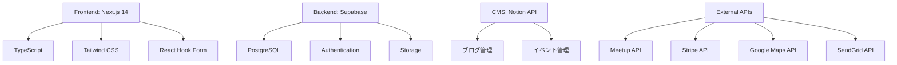
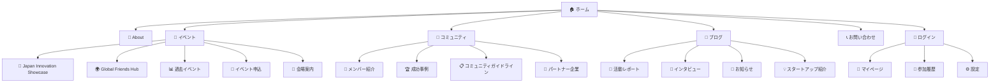
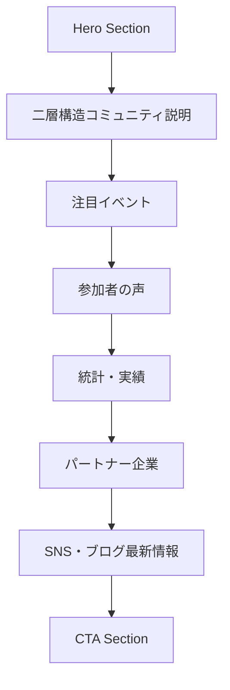
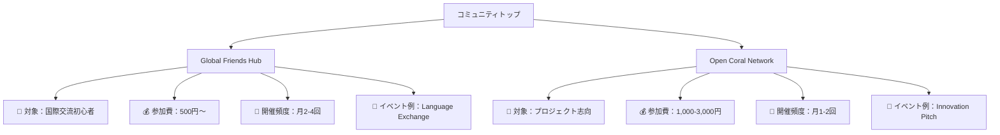
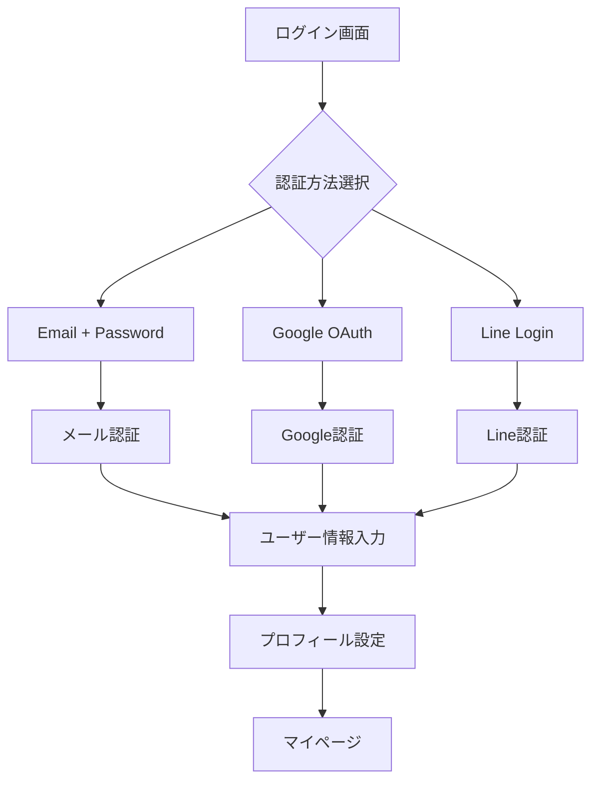
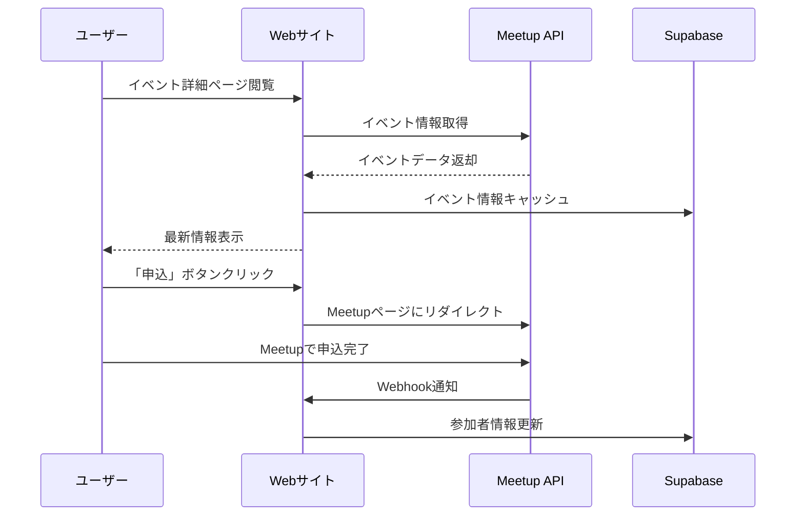
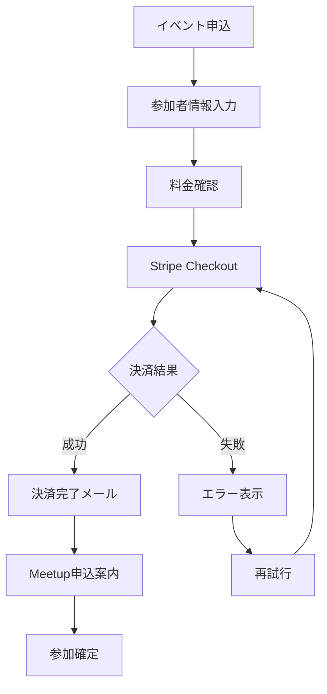
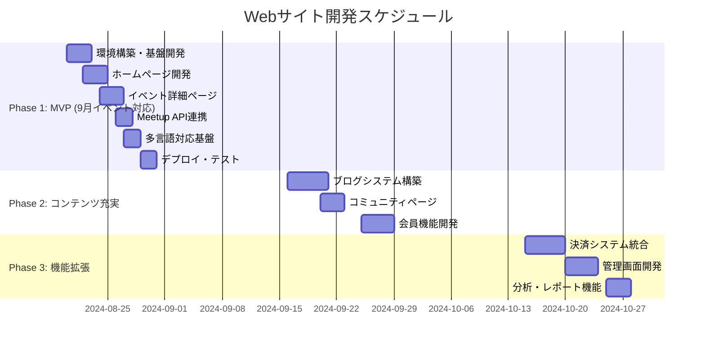
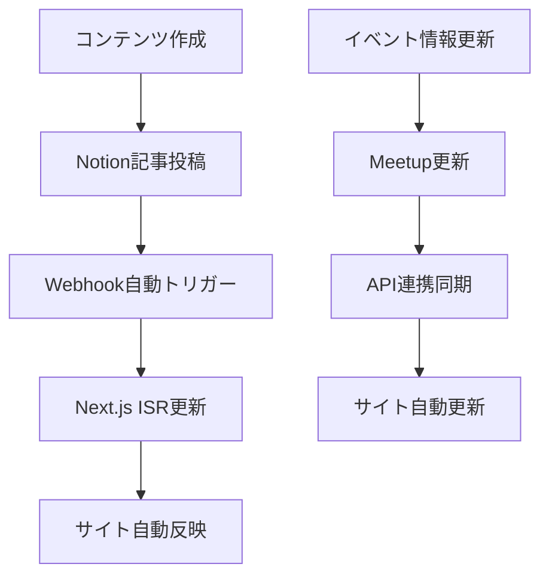

# 国際交流コミュニティ Webサイト設計書

## 1. プロジェクト概要

### 目的
- Japan Innovation Showcase（9月15日）の参加者募集
- 二層構造コミュニティ（Global Friends Hub / Open Coral Network）のオンライン基盤構築
- 国際交流イベントの継続的な告知・運営プラットフォーム

### ターゲットユーザー
- **外国人在住者・留学生**（30%）
- **日本人クリエイター・起業家**（40%）
- **国際交流に興味がある日本人**（30%）

## 2. 技術仕様

### 2.1 技術スタック



### 2.2 開発環境
| 項目 | 技術・サービス | 理由 |
|------|---------------|------|
| **Frontend Framework** | Next.js 14 (App Router) | SEO最適化・パフォーマンス・開発効率 |
| **Language** | TypeScript | 型安全性・保守性 |
| **UI Framework** | Tailwind CSS | 高速開発・一貫性・レスポンシブ |
| **State Management** | Zustand | 軽量・シンプル |
| **Form Management** | React Hook Form | パフォーマンス・バリデーション |
| **Database** | Supabase (PostgreSQL) | リアルタイム・認証・コスト効率 |
| **File Storage** | Supabase Storage | 画像・動画アップロード |
| **Authentication** | Supabase Auth | OAuth・メール認証 |
| **CMS** | Notion API | 非エンジニアでも更新可能 |
| **Payment** | Stripe | 国際決済対応 |
| **Email** | SendGrid | トランザクションメール |
| **Deployment** | Vercel | 自動デプロイ・CDN |
| **Analytics** | Google Analytics 4 | アクセス解析 |

## 3. サイトマップ



## 4. ページ設計

### 4.1 ホームページ

#### Hero Section
```
📌 メインビジュアル：Japan Innovation Showcase 告知
📅 開催日時：9月15日（日）18:00-20:30
📍 会場：はるみらい（晴海）
🎫 申込ボタン：Meetup連携
🌐 言語切替：日/EN/中/韓
```

#### コンテンツセクション


### 4.2 イベント詳細ページ

#### レイアウト構成
```
🎯 イベントヘッダー
├ イベント名・キャッチコピー
├ 開催日時・会場情報
├ 参加費・定員
└ 申込ボタン

📋 プログラム詳細
├ タイムスケジュール
├ 出展者紹介
├ ピッチセッション
└ ネットワーキング

📍 アクセス情報
├ Google Maps埋込
├ 電車・バスルート
├ 駐車場情報
└ 当日連絡先

💳 申込・決済
├ Meetup連携申込
├ Stripe決済
├ 参加者情報入力
└ 確認メール送信
```

### 4.3 コミュニティページ



### 4.4 ブログページ

#### カテゴリ設計
| カテゴリ | 目的 | 更新頻度 | 執筆者 |
|----------|------|----------|--------|
| **活動レポート** | イベント様子・成果共有 | イベント後48時間以内 | 運営チーム |
| **インタビュー** | 参加者・出展者紹介 | 月2-3本 | ライター委託 |
| **お知らせ** | 重要情報・変更事項 | 随時 | 運営チーム |
| **スタートアップ紹介** | 出展企業・プロジェクト | 月4-5本 | 出展者投稿 |
| **文化交流コラム** | 国際的な視点・体験談 | 月2-3本 | ゲスト投稿 |

## 5. 機能仕様

### 5.1 ユーザー認証



#### ユーザー情報設計
```typescript
interface User {
  id: string
  email: string
  name: string
  avatar_url?: string
  bio?: string
  languages: string[] // ['ja', 'en', 'zh']
  interests: string[] // ['startup', 'culture', 'art']
  role: 'member' | 'organizer' | 'admin'
  join_date: Date
  event_history: EventParticipation[]
}
```

### 5.2 イベント管理システム

#### イベントデータ構造
```typescript
interface Event {
  id: string
  title: string
  description: string
  category: 'global_friends' | 'open_coral'
  date: Date
  duration: number // minutes
  venue: Venue
  capacity: number
  price: number
  status: 'upcoming' | 'ongoing' | 'completed' | 'cancelled'
  meetup_url: string
  registration_url: string
  participants: Participant[]
}
```

### 5.3 Meetup API連携



### 5.4 決済システム

#### Stripe連携フロー


## 6. UI/UX設計

### 6.1 デザインシステム

#### カラーパレット
```css
/* Primary Colors */
--primary-blue: #1E40AF    /* メインブランドカラー */
--primary-orange: #EA580C  /* アクセントカラー */
--primary-green: #059669   /* 成功・完了 */

/* Secondary Colors */
--secondary-gray: #6B7280  /* テキスト・ボーダー */
--secondary-light: #F3F4F6 /* 背景・セクション */
--secondary-white: #FFFFFF /* ベース背景 */

/* Semantic Colors */
--error-red: #DC2626       /* エラー・警告 */
--warning-yellow: #D97706  /* 注意・確認 */
--info-blue: #2563EB       /* 情報・リンク */
```

#### タイポグラフィ
```css
/* Japanese */
--font-ja: 'Noto Sans JP', sans-serif;

/* English */
--font-en: 'Inter', sans-serif;

/* Heading Sizes */
--text-4xl: 2.25rem;  /* 36px - Page Title */
--text-3xl: 1.875rem; /* 30px - Section Title */
--text-2xl: 1.5rem;   /* 24px - Card Title */
--text-xl: 1.25rem;   /* 20px - Subtitle */
--text-lg: 1.125rem;  /* 18px - Body Large */
--text-base: 1rem;    /* 16px - Body */
--text-sm: 0.875rem;  /* 14px - Caption */
```

### 6.2 レスポンシブデザイン

#### ブレイクポイント
```css
/* Tailwind CSS ブレイクポイント採用 */
sm: 640px   /* スマートフォン横 */
md: 768px   /* タブレット縦 */
lg: 1024px  /* ノートPC */
xl: 1280px  /* デスクトップ */
2xl: 1536px /* 大型ディスプレイ */
```

#### レイアウト優先順位
1. **Mobile First**: スマートフォン最適化
2. **Progressive Enhancement**: 大画面での機能追加
3. **Touch Friendly**: ボタンサイズ44px以上
4. **Accessibility**: WCAG 2.1 AA準拠

### 6.3 コンポーネント設計

#### 主要コンポーネント
```
🔵 Button
├ Primary (action)
├ Secondary (sub-action)  
├ Ghost (tertiary)
└ Link (text)

📱 Card
├ Event Card
├ Member Card
├ Blog Card
└ Feature Card

📝 Form
├ Input Field
├ Select Dropdown
├ Checkbox/Radio
└ File Upload

🎯 Navigation
├ Header Nav
├ Mobile Menu
├ Breadcrumb
└ Pagination
```

## 7. 多言語対応

### 7.1 対応言語

| 言語 | 対応レベル | 優先度 | 備考 |
|------|------------|--------|------|
| **日本語** | 完全対応 | 最高 | メイン言語 |
| **English** | 完全対応 | 高 | 外国人ユーザー向け |
| **简体中文** | 基本対応 | 中 | 中国系参加者向け |
| **한국어** | 基本対応 | 中 | 韓国系参加者向け |

### 7.2 翻訳管理

```mermaid
flowchart TD
    A[next-i18next] --> B[JSON翻訳ファイル]
    B --> C[日本語 (ja.json)]
    B --> D[英語 (en.json)]
    B --> E[中国語 (zh.json)]
    B --> F[韓国語 (ko.json)]
    
    G[Notion CMS] --> H[多言語コンテンツ]
    H --> I[ブログ記事翻訳]
    H --> J[イベント説明翻訳]
```

## 8. パフォーマンス最適化

### 8.1 Core Web Vitals目標値

| 指標 | 目標値 | 施策 |
|------|--------|------|
| **LCP** | < 2.5秒 | 画像最適化・CDN活用 |
| **FID** | < 100ms | Code Splitting・遅延ローディング |
| **CLS** | < 0.1 | 明確なサイズ指定・Skeleton UI |

### 8.2 最適化施策

```mermaid
graph TB
    A[パフォーマンス最適化] --> B[画像最適化]
    A --> C[コード最適化]
    A --> D[キャッシュ戦略]
    
    B --> B1[Next.js Image Component]
    B --> B2[WebP/AVIF対応]
    B --> B3[レスポンシブ画像]
    
    C --> C1[Code Splitting]
    C --> C2[Tree Shaking]
    C --> C3[Dynamic Import]
    
    D --> D1[Static Generation]
    D --> D2[ISR (Incremental Static Regeneration)]
    D --> D3[CDN (Vercel Edge Network)]
```

## 9. SEO戦略

### 9.1 技術SEO

#### メタタグ最適化
```typescript
// pages/events/[slug].tsx
export async function generateMetadata({ params }: Props): Promise<Metadata> {
  const event = await getEvent(params.slug)
  
  return {
    title: `${event.title} | Japan Innovation Showcase`,
    description: event.description.substring(0, 160),
    openGraph: {
      title: event.title,
      description: event.description,
      images: [event.featured_image],
      type: 'website',
      locale: 'ja_JP',
      alternateLocale: ['en_US', 'zh_CN', 'ko_KR']
    },
    twitter: {
      card: 'summary_large_image',
      title: event.title,
      description: event.description,
      images: [event.featured_image]
    }
  }
}
```

### 9.2 コンテンツSEO

#### ターゲットキーワード
```
Primary Keywords:
- "国際交流 東京"
- "startup event Tokyo"
- "日本 イノベーション"
- "cultural exchange Japan"

Long-tail Keywords:
- "外国人 ネットワーキング 東京"
- "Japan startup showcase 2024"
- "はるみらい イベント 国際交流"
- "Tokyo innovation community"
```

### 9.3 構造化データ

```json
{
  "@context": "https://schema.org",
  "@type": "Event",
  "name": "Japan Innovation Showcase",
  "startDate": "2024-09-15T18:00:00+09:00",
  "endDate": "2024-09-15T20:30:00+09:00",
  "location": {
    "@type": "Place",
    "name": "はるみらい",
    "address": {
      "@type": "PostalAddress",
      "streetAddress": "晴海1-8-8",
      "addressLocality": "中央区",
      "addressRegion": "東京都",
      "postalCode": "104-0053",
      "addressCountry": "JP"
    }
  },
  "organizer": {
    "@type": "Organization",
    "name": "Japan Innovation Showcase",
    "url": "https://japan-innovation-showcase.com"
  }
}
```

## 10. 開発スケジュール

### 10.1 フェーズ別開発計画



### 10.2 リソース配分

| フェーズ | 期間 | 工数 | 予算 | 成果物 |
|----------|------|------|------|--------|
| **MVP** | 8/20-8/31 | 80時間 | 40万円 | 基本サイト・イベント集客 |
| **Phase 2** | 9/16-9/30 | 60時間 | 30万円 | CMS・コミュニティ機能 |
| **Phase 3** | 10/15-10/31 | 40時間 | 20万円 | 決済・管理機能 |

## 11. 運用・保守

### 11.1 月額運用コスト

| サービス | 月額料金 | 用途 |
|----------|----------|------|
| **Vercel Pro** | $20 | ホスティング・CDN |
| **Supabase Pro** | $25 | データベース・認証 |
| **Stripe** | 3.6% | 決済手数料 |
| **SendGrid** | $15 | メール配信 |
| **Google Maps API** | ~$10 | 地図表示 |
| **ドメイン** | $12/年 | japan-innovation-showcase.com |
| **合計** | **約$70-80** | **約10,000円** |

### 11.2 コンテンツ更新フロー



## 12. 成功指標・KPI

### 12.1 定量指標

| カテゴリ | KPI | 目標値（3ヶ月） | 測定方法 |
|----------|-----|------------------|----------|
| **トラフィック** | 月間PV | 50,000PV | Google Analytics |
| **コンバージョン** | イベント申込率 | 3% | 申込/PV |
| **エンゲージメント** | 平均滞在時間 | 3分以上 | GA4 |
| **SEO** | オーガニック流入 | 60% | Search Console |
| **多言語** | 英語ページPV | 30% | GA4言語レポート |

### 12.2 定性指標

- **ユーザビリティ**: イベント申込完了率90%以上
- **ブランド認知**: 検索エンジンでの「国際交流 東京」上位表示
- **コミュニティ**: 月間新規会員100名獲得
- **満足度**: ユーザーフィードバック4.5/5.0以上

---

## 関連資料
- [メインイベント企画書](./企画書.md)
- [PR戦略・マーケティング戦略](./PR戦略.md)
- [会場詳細：はるみらい](./会場詳細_はるみらい.md)
- [大学・センター営業戦略](./大学・センター営業戦略.md)

**次のアクション**: 開発チーム選定・技術要件確定・8月20日開発開始