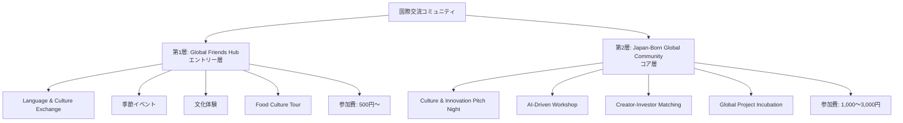
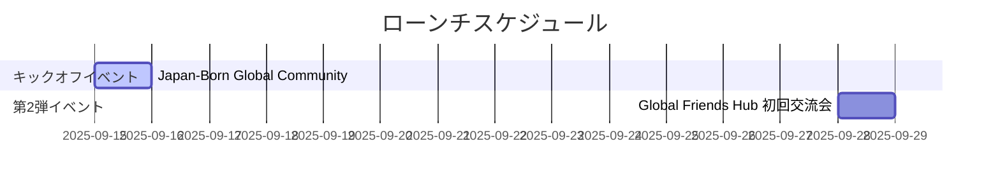
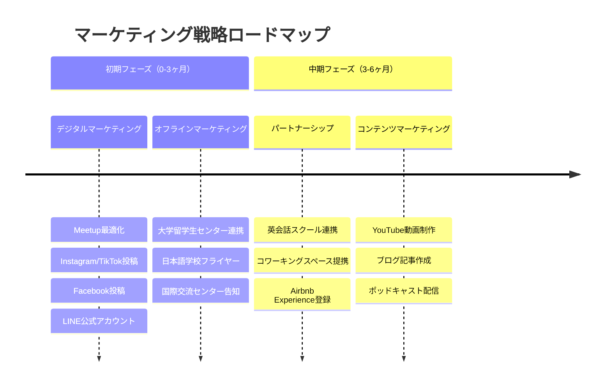
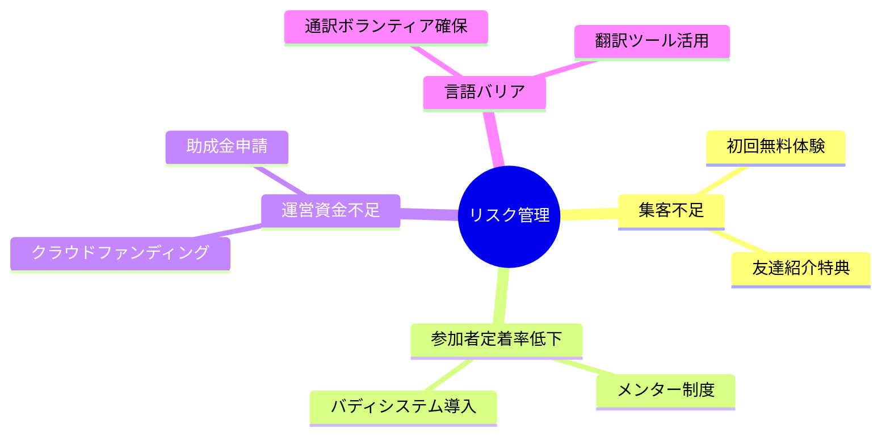
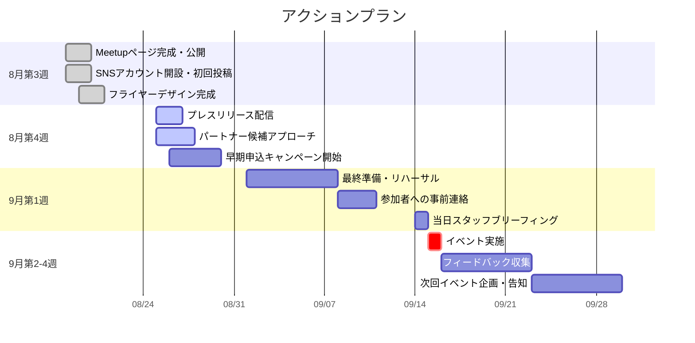

# 国際交流コミュニティ事業企画書

## 1. 事業概要

### ビジョン
日本と世界を繋ぐ「文化×技術×人」の交流プラットフォームを構築し、グローバルな視点から新たな価値創造とイノベーションを生み出す

### ミッション
- オンラインとオフラインを融合した「リアルな人間関係」の構築
- 日本文化の魅力を世界に発信しながら、多様な文化から学ぶ
- アイデアを実現に導く実践的なサポート体制の提供

## 2. 二層構造コミュニティ戦略



### 【第1層】Global Friends Hub（エントリー層）

| 項目 | 内容 |
|------|------|
| 役割 | 参加障壁を下げた気軽な国際交流の入口 |
| 参加費 | 500円〜 |
| 開催頻度 | 月2〜4回 |
| 対象 | 初心者歓迎 |

**主要イベント：**
- Language & Culture Exchange（月2回）
- 季節イベント（花見、紅葉散策等）
- 日本文化体験（書道、着物、茶道）
- Food Culture Tour（ラーメン、寿司体験）

### 【第2層】Japan-Born Global Community（コア層）

| 項目 | 内容 |
|------|------|
| 役割 | プロジェクト創出と深い価値創造の場 |
| 参加費 | 1,000〜3,000円 |
| 特徴 | プロジェクト志向、AI技術活用 |
| 対象 | 実践的活動を求める参加者 |

**主要イベント：**
- Culture & Innovation Pitch Night
- AI-Driven Workshop
- Creator-Investor Matching Session
- Global Project Incubation

## 3. 2025年9月ローンチ計画



### 第1弾イベント：Japan-Born Global Community キックオフ

| 項目 | 詳細 |
|------|------|
| 開催日 | 9月15日（日） |
| テーマ | Culture & Innovation Pitch Night |
| 時間 | 18:00-20:30 |
| 会場 | コワーキングスペース（渋谷/六本木エリア） |
| 定員 | 30名 |
| 参加費 | 1,500円（軽食・ドリンク付） |

**プログラム：**
- 18:00-18:15 オープニング＆ビジョン共有
- 18:15-19:15 3分ピッチセッション（8-10名）
- 19:15-20:00 テーマ別ネットワーキング
- 20:00-20:30 次回予告＆クロージング

### 第2弾イベント：Global Friends Hub 初回交流会

| 項目 | 詳細 |
|------|------|
| 開催日 | 9月28日（日） |
| 内容 | Language & Culture Exchange |
| 時間 | 16:00-18:00 |
| 会場 | Cafe & Bar HIVE（日本橋） |
| 定員 | 40名 |
| 参加費 | 500円（ワンドリンク付） |

## 4. マーケティング戦略



## 5. 収益モデル

### 収益源

| 収益源 | 目標金額 |
|--------|----------|
| イベント参加費 | 月間 15万円 |
| 企業スポンサーシップ | 四半期 30万円 |
| プロジェクトコンサルティング | 年間 100万円 |
| 文化体験プログラム | 月間 10万円 |

### コスト構造

| 項目 | 月額 |
|------|------|
| 会場費 | 5万円 |
| マーケティング費 | 3万円 |
| 運営人件費 | 10万円 |
| その他経費 | 2万円 |
| **合計** | **20万円** |

## 6. KPI設定

```mermaid
xychart-beta
    title "成長目標"
    x-axis [3ヶ月, 6ヶ月, 1年]
    y-axis "参加者数" 0 --> 2000
    bar [300, 800, 2000]
```

| 期間 | 総参加者数 | コアメンバー | SNSフォロワー | プロジェクト立ち上げ | イベント開催数 |
|------|------------|--------------|---------------|---------------------|----------------|
| 短期（3ヶ月） | 300名 | 20名 | 500名 | - | 12回 |
| 中期（6ヶ月） | 800名 | 50名 | 1,500名 | 3件 | - |
| 長期（1年） | 2,000名 | 100名 | 5,000名 | 10件 | - |

**特記事項：** 第2層への移行率目標 20％（1年）

## 7. リスク管理



## 8. 成功要因

### クリティカルサクセスファクター

| 要因 | 説明 |
|------|------|
| 参加者体験の質 | 「また来たい」と思える空間づくり |
| コミュニティの温度感 | 排他的にならない包容力 |
| 実践的な価値提供 | 単なる交流を超えた成長機会 |
| 持続可能な運営 | ボランティア依存からの脱却 |

## 9. アクションプラン（9月まで）



### 詳細タスク

#### 8月第3週
- [x] Meetupページ完成・公開
- [x] SNSアカウント開設・初回投稿
- [x] フライヤーデザイン完成

#### 8月第4週
- [ ] プレスリリース配信
- [ ] パートナー候補へのアプローチ
- [ ] 早期申込キャンペーン開始

#### 9月第1週
- [ ] 最終準備・リハーサル
- [ ] 参加者への事前連絡
- [ ] 当日スタッフブリーフィング

#### 9月第2-4週
- [ ] イベント実施
- [ ] 参加者フィードバック収集
- [ ] 次回イベント企画・告知

---

*この企画書は、日本と世界を繋ぐ国際交流コミュニティの創設を目的とした包括的な事業計画書です。*