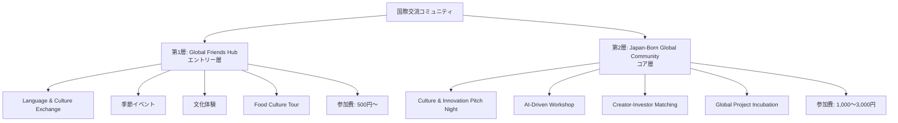
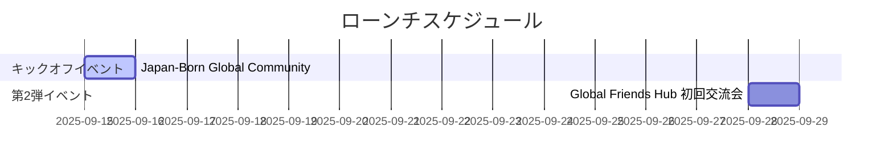
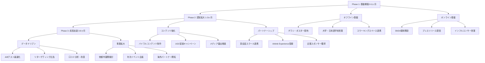
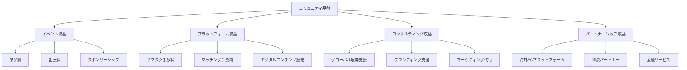
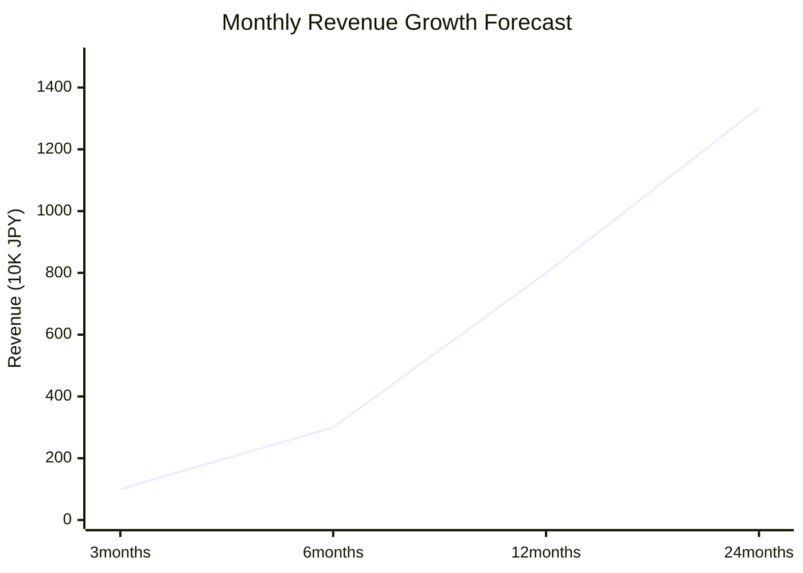
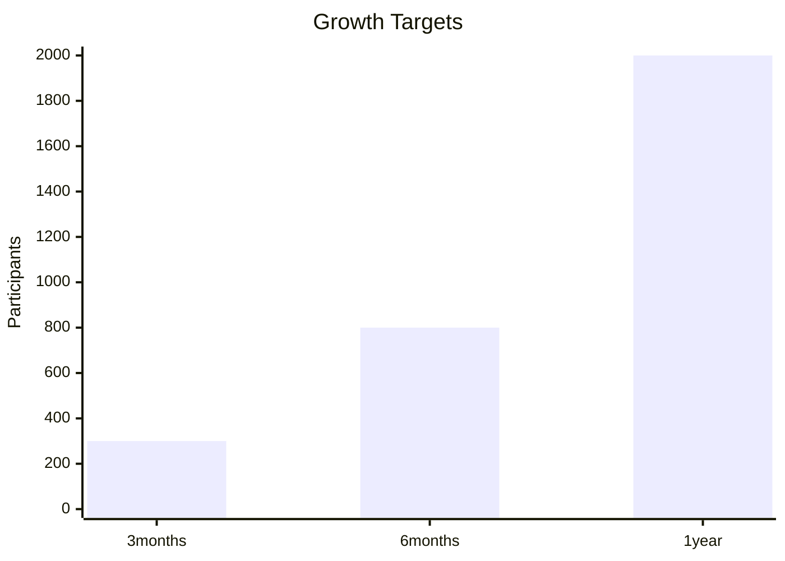
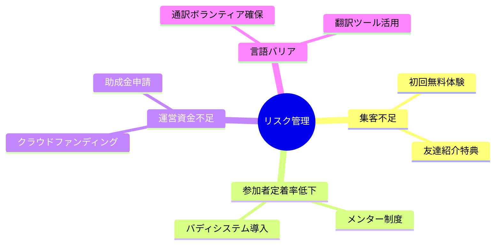
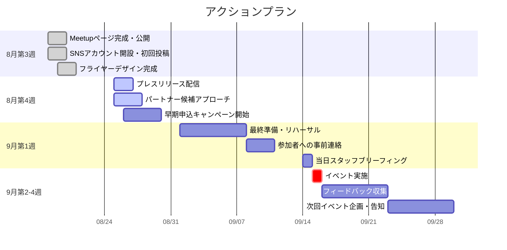

# 国際交流コミュニティ事業企画書

## 1. 事業概要

### ビジョン
日本と世界を繋ぐ「文化×技術×人」の交流プラットフォームを構築し、グローバルな視点から新たな価値創造とイノベーションを生み出す

### ミッション
- オンラインとオフラインを融合した「リアルな人間関係」の構築
- 日本文化の魅力を世界に発信しながら、多様な文化から学ぶ
- アイデアを実現に導く実践的なサポート体制の提供

## 2. 二層構造コミュニティ戦略

### 【第1層】Global Friends Hub（エントリー層）

**🌐 Meetupグループ**: [Global Friends Hub](https://www.meetup.com/ja-JP/global-friends-hub/)

| 項目 | 内容 |
|------|------|
| 役割 | 参加障壁を下げた気軽な国際交流の入口 |
| 参加費 | 500円〜 |
| 開催頻度 | 月2〜4回 |
| 対象 | 初心者歓迎 |

**主要イベント：**
- Language & Culture Exchange（月2回）
- 季節イベント（花見、紅葉散策等）
- 日本文化体験（書道、着物、茶道）
- Food Culture Tour（ラーメン、寿司体験）

### 【第2層】Japan-Born Global Community（コア層）

**🌐 Meetupグループ**: [Open Coral Network](https://www.meetup.com/ja-JP/open-coral-network/)

| 項目 | 内容 |
|------|------|
| 役割 | プロジェクト創出と深い価値創造の場 |
| 参加費 | 1,000〜3,000円 |
| 特徴 | プロジェクト志向、AI技術活用 |
| 対象 | 実践的活動を求める参加者 |

**主要イベント：**
- Culture & Innovation Pitch Night
- AI-Driven Workshop
- Creator-Investor Matching Session
- Global Project Incubation

## 3. 2025年9月ローンチ計画

### 第1弾イベント：Japan Innovation Showcase

**🎫 イベント申込**: [Open Coral Network - Japan Innovation Showcase](https://www.meetup.com/ja-JP/open-coral-network/)

| 項目 | 詳細 |
|------|------|
| 開催日 | 9月15日（日） |
| テーマ | 日本発グローバル × クリエイター × 小規模企業の展示交流会 |
| 時間 | 18:00-20:30 |
| 会場 | はるみらい（晴海）地域活動スタジオ |
| 定員 | 30名（出展者10名 + 来場者20名） |
| 参加費 | 出展者: 3,000円 / 来場者: 1,500円 |
| 会場費 | **無料**（地域活動支援施設） |
| 設備 | 仮設ステージ・166.3㎡・プロジェクター持込可 |

**📍 会場詳細**: [はるみらい会場詳細](./会場詳細_はるみらい.md) 参照

**🏢 代替会場検討**: [TOKYO UPGRADE SQUARE](./会場詳細_TOKYO_UPGRADE_SQUARE.md) - 将来の行政連携イベント候補

```mermaid
gantt
    title Japan Innovation Showcase プログラム
    dateFormat  HH:mm
    axisFormat  %H:%M
    
    section ウェルカムフェーズ
    ブース巡り・自由交流     :welcome1, 18:00, 30m
    
    section ショーケースフェーズ
    イノベーションピッチ     :pitch1, 18:30, 45m
    
    section コラボフェーズ
    マッチングラウンドテーブル :collab1, 19:15, 45m
    
    section ネクストステップ
    コミットメント&クロージング :next1, 20:00, 30m
```

**詳細プログラム：**

#### 18:00-18:30 ウェルカムブース巡り
- **日本クリエイター・企業ブース展示**（8-10ブース）
  - 伝統工芸×現代デザイン
  - 地域特産品のグローバル化アイテム
  - AI活用サービス・ツール
  - アート・デザイン作品
  - フードテック・発酵食品
- **試食・試用・体験コーナー**
- **グローバル展開相談ブース**

#### 18:30-19:15 イノベーションピッチセッション
- **選抜ピッチ**（4組 × 5分ピッチ + 2分Q&A）
  - テーマ：「世界に届けたい日本の価値」
  - 審査員：投資家・海外バイヤー・グローバルマーケター
- **リアルタイム投票**（QRコード活用）
- **ベストピッチ賞・オーディエンス賞の発表**

#### 19:15-20:00 マッチングラウンドテーブル
**専門テーブル設置：**
- **A卓**: グローバルマーケティング戦略
- **B卓**: 海外ECプラットフォーム活用
- **C卓**: クリエイター×企業コラボレーション
- **D卓**: サブスクリプション事業モデル構築

各テーブルに専門家ファシリテーター配置、具体的なアクションプラン作成

#### 20:00-20:30 コミットメント&ネクストステップ
- **当日マッチング結果発表**
- **月間「Global Creator Market」告知**
- **Japan Export Hub（サブスクプラットフォーム）beta版紹介**
- **次回イベント予告・早期申込特典案内**

**特別企画：**
- **Cultural Fusion Box**: 参加クリエイターの商品詰め合わせお土産
- **Global Networking Card**: 国際的なデジタル名刺交換
- **Collaboration Matching Sheet**: スキル・ニーズマッチングシート

### 第2弾イベント：Global Friends Hub 初回交流会

**🎫 イベント申込**: [Global Friends Hub - Language Exchange](https://www.meetup.com/ja-JP/global-friends-hub/)

| 項目 | 詳細 |
|------|------|
| 開催日 | 9月28日（日） |
| 内容 | Language & Culture Exchange |
| 時間 | 16:00-18:00 |
| 会場 | Cafe & Bar HIVE（日本橋） |
| 定員 | 40名 |
| 参加費 | 500円（ワンドリンク付） |

## 4. マーケティング戦略

**📋 詳細戦略**: [PR戦略・マーケティング戦略](./PR戦略.md) 参照  
**🏛️ 大学営業**: [大学・センター営業戦略](./大学・センター営業戦略.md) 参照  
**💻 Webサイト設計**: [Webサイト設計書](./Webサイト設計書.md) 参照

### 主要マーケティング施策

#### 🎯 ターゲット別アプローチ
- **外国人層**: 英語SNS、国際交流施設、大使館連携
- **クリエイター層**: コワーキングスペース、アート系イベント
- **起業家層**: スタートアップコミュニティ、ビジネスメディア
- **学生層**: 大学国際部、日本語学校、留学生センター

#### 📊 成果指標
- **SNS総リーチ**: 10万人/月
- **イベント認知率**: ターゲット層の15%
- **申込転換率**: 3%（認知→申込）
- **リピート率**: 60%（初回→2回目参加）

## 5. 創造的収益エコシステム

### 主要収益源

#### 1. イベント・体験収益
| 収益源 | 単価 | 頻度/規模 | 月間目標 |
|--------|------|-----------|----------|
| 第2層イベント参加費 | 1,500-3,000円 | 月2回×20名 | 6-12万円 |
| 第1層イベント参加費 | 500-800円 | 月4回×30名 | 6-10万円 |
| 出展ブース料 | 3,000-5,000円 | 月2回×8ブース | 5-8万円 |
| VIP体験プログラム | 8,000-15,000円 | 月1回×10名 | 8-15万円 |
| **小計** | | | **25-45万円** |

#### 2. Japan Export Hub（サブスクプラットフォーム）
| 収益源 | 料金体系 | 想定規模 | 月間目標 |
|--------|----------|----------|----------|
| 基本出品料 | 月額2,980円 | 50店舗 | 15万円 |
| 成功報酬手数料 | 売上の8-12% | 月商500万円 | 40-60万円 |
| プレミアム機能 | 月額9,800円 | 20店舗 | 20万円 |
| 海外配送代行 | 1件500-1,500円 | 月1,000件 | 50-150万円 |
| **小計** | | | **125-245万円** |

#### 3. マッチング・コンサルティング
| 収益源 | 料金体系 | 想定件数 | 月間目標 |
|--------|----------|----------|----------|
| グローバル展開コンサル | 20-50万円/件 | 月2-3件 | 40-150万円 |
| ブランディング支援 | 10-30万円/件 | 月3-5件 | 30-150万円 |
| マッチング成功報酬 | 成約額の10-20% | 月5-10件 | 20-100万円 |
| オンライン講座 | 月額4,980円 | 100名 | 50万円 |
| **小計** | | | **140-450万円** |

#### 4. パートナーシップ・ライセンス
| 収益源 | 料金体系 | 想定規模 | 月間目標 |
|--------|----------|----------|----------|
| 企業スポンサーシップ | 10-30万円/月 | 3-5社 | 30-150万円 |
| アフィリエイト収益 | 成約額の3-5% | 月商2,000万円 | 60-100万円 |
| ライセンス収益 | 売上の2-3% | 月商1,500万円 | 30-45万円 |
| データ分析レポート | 5-15万円/月 | 10-20社 | 50-300万円 |
| **小計** | | | **170-595万円** |

### 収益成長シナリオ

| フェーズ | 期間 | 月間収益目標 | 主要収益源 |
|----------|------|--------------|------------|
| **スタートアップ** | 0-3ヶ月 | 50-100万円 | イベント収益中心 |
| **成長期** | 3-12ヶ月 | 300-800万円 | プラットフォーム本格稼働 |
| **拡大期** | 12-24ヶ月 | 800-1,335万円 | 全収益源フル活用 |
| **成熟期** | 24ヶ月以降 | 1,500万円+ | 海外展開・フランチャイズ |

### コスト最適化戦略

| 項目 | 初期 | 6ヶ月後 | 12ヶ月後 | 最適化施策 |
|------|------|---------|-----------|------------|
| 会場費 | 8万円 | 15万円 | 25万円 | 提携会場・固定契約 |
| 人件費 | 15万円 | 40万円 | 80万円 | 成果報酬制・業務委託活用 |
| マーケティング費 | 5万円 | 20万円 | 50万円 | ROI重視・口コミ活用 |
| システム開発・運用 | 10万円 | 30万円 | 60万円 | 外部パートナー活用 |
| **利益率目標** | **30%** | **45%** | **60%** | **スケールメリット活用** |

### 収益多角化のイノベーション

1. **NFT文化財プロジェクト**: 日本の伝統工芸をNFT化し、世界販売
2. **Cultural Subscription Box**: 月額制日本文化体験ボックス
3. **グローバルクリエイター養成プログラム**: 認定資格制度
4. **バーチャル展示会プラットフォーム**: VR/AR技術活用
5. **文化外交プログラム**: 政府・自治体との連携事業

## 6. KPI設定

| 期間 | 総参加者数 | コアメンバー | SNSフォロワー | プロジェクト立ち上げ | イベント開催数 |
|------|------------|--------------|---------------|---------------------|----------------|
| 短期（3ヶ月） | 300名 | 20名 | 500名 | - | 12回 |
| 中期（6ヶ月） | 800名 | 50名 | 1,500名 | 3件 | - |
| 長期（1年） | 2,000名 | 100名 | 5,000名 | 10件 | - |

**特記事項：** 第2層への移行率目標 20％（1年）

## 7. リスク管理

## 8. 成功要因

### クリティカルサクセスファクター

| 要因 | 説明 |
|------|------|
| 参加者体験の質 | 「また来たい」と思える空間づくり |
| コミュニティの温度感 | 排他的にならない包容力 |
| 実践的な価値提供 | 単なる交流を超えた成長機会 |
| 持続可能な運営 | ボランティア依存からの脱却 |

## 9. アクションプラン（9月まで）

### 詳細タスク

#### 8月第3週
- [x] Meetupページ完成・公開
- [x] SNSアカウント開設・初回投稿
- [x] フライヤーデザイン完成

#### 8月第4週
- [ ] プレスリリース配信
- [ ] パートナー候補へのアプローチ
- [ ] 早期申込キャンペーン開始

#### 9月第1週
- [ ] 最終準備・リハーサル
- [ ] 参加者への事前連絡
- [ ] 当日スタッフブリーフィング

#### 9月第2-4週
- [ ] イベント実施
- [ ] 参加者フィードバック収集
- [ ] 次回イベント企画・告知

---

*この企画書は、日本と世界を繋ぐ国際交流コミュニティの創設を目的とした包括的な事業計画書です。*