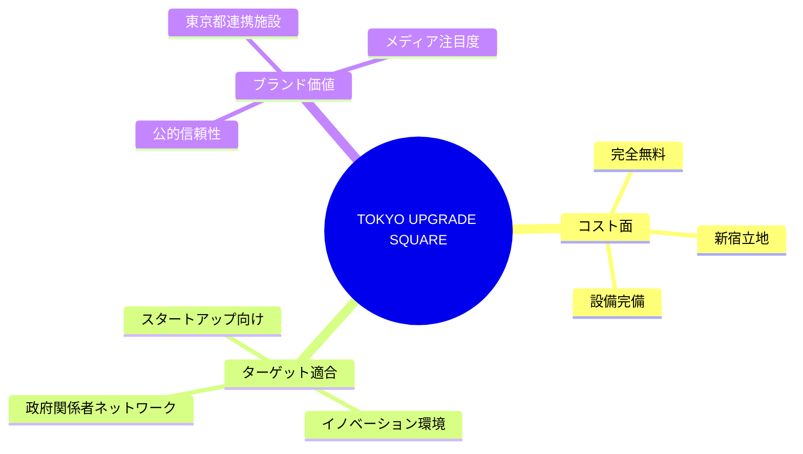
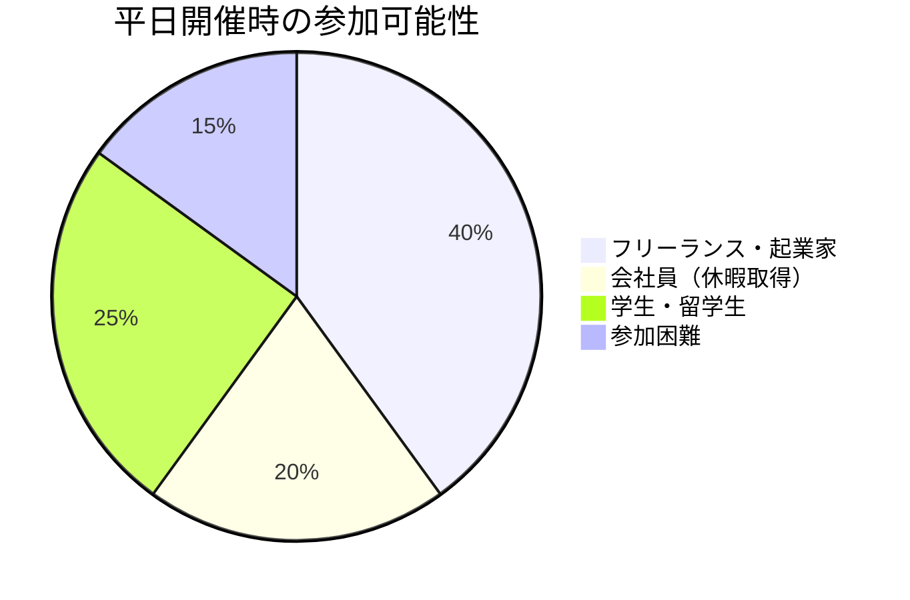
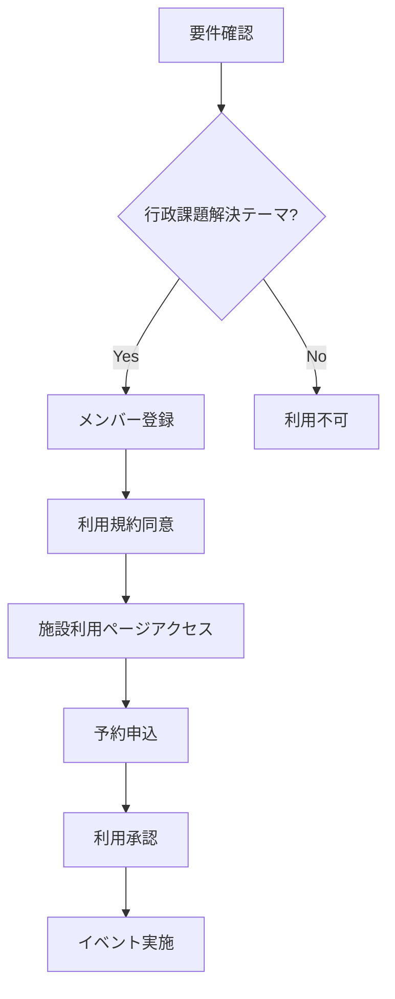

# 会場詳細：TOKYO UPGRADE SQUARE

## 施設概要

| 項目 | 詳細 |
|------|------|
| 施設名 | TOKYO UPGRADE SQUARE |
| 住所 | 新宿住友ビル 25階 |
| 運営 | 東京都・民間連携施設 |
| 公式サイト | https://upgrade-square.jp/ |
| 利用コンセプト | スタートアップ×行政課題解決 |

## 利用可能スペース

### 1. コワーキング・イベントスペース（メイン会場）

| 項目 | 詳細 |
|------|------|
| **定員** | イベント時：32-60名 / コワーキング時：44-52名 |
| **利用料** | **完全無料** |
| **予約** | イベント利用時：要予約 |
| **利用時間** | 平日 10:00-17:00 |

### 2. 会議室（3室）

| 会議室 | 定員 | 利用料 | 予約 |
|--------|------|--------|------|
| Meeting Room A | 4名 | **無料** | 要予約 |
| Meeting Room B | 6名 | **無料** | 要予約 |
| Meeting Room C | 12名 | **無料** | 要予約 |

## Japan Innovation Showcase 適合性分析

### ✅ メリット

### ⚠️ 制約事項

| 制約 | 影響 | 対策 |
|------|------|------|
| **平日のみ** | 9月15日（日）利用不可 | **致命的制約** |
| 利用時間 10:00-17:00 | 18:00-20:30開催不可 | 開催時間変更必要 |
| 行政課題解決テーマ | 純粋な国際交流から逸脱 | コンセプト調整必要 |

## 代替案：平日開催への変更検討

### 📅 開催日時変更案

| 変更案 | 日時 | メリット | デメリット |
|--------|------|----------|----------|
| **案1** | 9月13日（金）15:00-17:00 | 会場無料・好立地 | 参加者集客困難 |
| **案2** | 9月20日（金）15:00-17:00 | 準備期間確保 | 平日参加障壁 |
| **案3** | 10月平日に延期 | 十分な準備期間 | Meetupスケジュール変更 |

### 🎯 ターゲット参加者への影響

## アクセス情報

### 🚇 電車アクセス
- **JR新宿駅** 直結（徒歩5分）
- **都営新宿線・大江戸線 新宿駅** 直結
- **東京メトロ丸ノ内線 新宿駅** 直結

### 🏢 新宿住友ビル内
- **25階** 直通エレベーター
- **受付**: 25階フロント
- **アクセス**: 新宿駅地下直結

## 予約・利用手続き

### 📝 利用申込フロー

### 📋 必要手続き
1. **メンバー登録**: https://upgrade-square.jp/apply
2. **施設利用申込**: https://upgrade-square.jp/space
3. **利用目的**: 行政課題解決に関連する内容
4. **承認**: 施設運営側の審査

### 📞 問い合わせ
- **Web申込**: 上記URLより
- **利用可能日**: [Googleカレンダー](https://calendar.google.com/calendar/u/0/embed?src=tus@co-ba.net&ctz=Asia/Tokyo)で確認

## 戦略的活用シナリオ

### 🔄 企画コンセプト調整案

現在のJapan Innovation Showcaseを以下に調整：

| 従来コンセプト | 調整後コンセプト |
|----------------|------------------|
| 国際交流中心 | **スタートアップ×行政課題解決** |
| クリエイター展示 | **行政DX・都市課題ソリューション** |
| 文化交流 | **国際的な政策イノベーション** |

### 🎯 新テーマ例
- **Tokyo Global Innovation Challenge**
- **行政DX × 国際クリエイター**
- **都市課題解決 × 海外展開**

## 比較：はるみらい vs TOKYO UPGRADE SQUARE

| 項目 | はるみらい | TOKYO UPGRADE SQUARE |
|------|------------|----------------------|
| **料金** | 無料 | 無料 |
| **定員** | 50名 | 32-60名 |
| **開催可能日** | ✅ 9月15日（日）OK | ❌ 平日のみ |
| **時間** | ✅ 9:00-21:00 | ❌ 10:00-17:00 |
| **立地** | 晴海（やや不便） | ✅ 新宿駅直結 |
| **ブランド価値** | 地域施設 | ✅ 東京都連携・高ブランド |
| **設備** | 基本設備 | ✅ 最新設備 |
| **ターゲット適合** | ✅ 汎用的 | ❌ 行政課題限定 |

## 推奨判断

### 🎯 **推奨：はるみらい継続**

**理由：**
1. **9月15日（日）開催可能** → スケジュール変更なし
2. **18:00-20:30時間帯OK** → 働く人も参加可能
3. **コンセプト制約なし** → 国際交流テーマ維持
4. **参加者アクセス重視** → 土日開催の価値

**TOKYO UPGRADE SQUARE活用案：**
- **第2フェーズ**: 政府連携イベントとして将来活用
- **フォローアップ**: 行政課題解決プロジェクトの拠点
- **ネットワーキング**: 政府関係者との関係構築

---

**結論**: 9月15日イベントは**はるみらい**で実施、TOKYO UPGRADE SQUAREは将来の行政連携イベントで活用