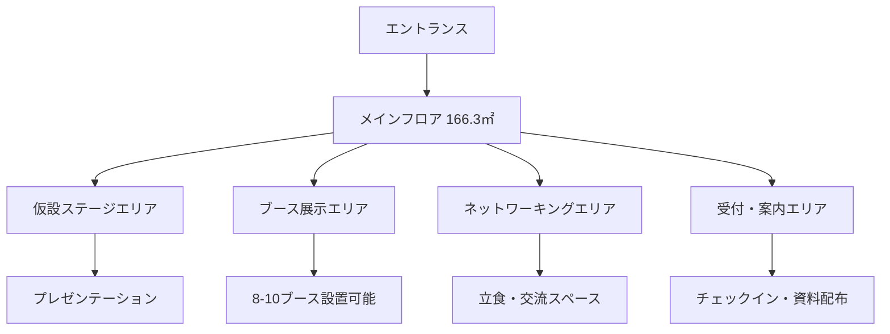

# 会場詳細：はるみらい

## 施設概要

| 項目 | 詳細 |
|------|------|
| 施設名 | はるみらい（晴海地域活動支援施設） |
| 住所 | 東京都中央区晴海1-8-8 |
| 運営 | 中央区指定管理施設 |
| 公式サイト | https://www.harumirai.jp/ |

## 利用スペース：地域活動スタジオ

### 基本情報

| 項目 | 詳細 |
|------|------|
| **定員** | 50名程度 |
| **広さ** | 166.3㎡ |
| **利用料** | **無料** |
| **利用時間** | 9:00～21:00 |
| **設備** | 仮設ステージ、自由出入可能 |

### 会場レイアウト優位性



### 設備・持込事項

#### ✅ 利用可能設備
- 仮設ステージ（講演・ピッチ用）
- 照明設備
- 電源コンセント
- 無料WiFi
- 空調設備

#### 📦 持込必要機材
- **プロジェクター**（スクリーン投影用）
- **マイク・音響システム**
- **ブース設営用テーブル**（8-10台）
- **装飾・看板類**
- **配布資料・ノベルティ**

## アクセス情報

### 🚇 電車アクセス
- **都営大江戸線 勝どき駅** 徒歩10分
- **都営バス 晴海1丁目停留所** 徒歩3分

### 🚗 車・タクシー
- 駐車場：あり（台数制限あり・要事前確認）
- タクシー：銀座・新橋から約15分

### 参加者向けアクセス案内
```
📍 はるみらい（晴海地域活動支援施設）
住所：東京都中央区晴海1-8-8
最寄り駅：都営大江戸線 勝どき駅 A2a出口より徒歩10分

🚇 電車でお越しの方
• 勝どき駅 A2a出口を出て晴海通りを直進
• 晴海1丁目交差点を左折
• 約3分で到着

🚌 バスでお越しの方  
• 都営バス「晴海1丁目」停留所下車 徒歩3分
```

## 予約・手続き情報

### 📞 予約連絡先
- **電話**：03-6204-6900
- **受付時間**：9:00-21:00
- **Web**：https://www.harumirai.jp/facility/

### 📋 予約手順
1. **電話で空き状況確認**（9月15日 17:30-21:00）
2. **仮予約申込**
3. **利用申請書提出**
4. **設営・機材持込詳細相談**

### 📝 提出書類
- 利用申請書
- イベント企画書
- 責任者連絡先
- 設営図面（ブース配置等）

## イベント収益改善効果

### 💰 コスト削減効果

| 項目 | 一般会場 | はるみらい | 差額 |
|------|----------|------------|------|
| 会場費 | 8-15万円 | **0円** | **▲8-15万円** |
| 設営費 | 3-5万円 | 2-3万円 | ▲1-2万円 |
| **合計削減** | | | **▲9-17万円** |

### 📈 収益向上効果
- **売上変更なし**：参加費収入 7.5万円（30名）
- **コスト大幅削減**：会場費0円
- **純利益向上**：+9-17万円

### 🎯 戦略的メリット
1. **予算をマーケティングに集中投下可能**
2. **次回イベントへの投資余力確保**
3. **参加費を抑えた参加障壁の低減**
4. **地域コミュニティとの連携強化**

## 当日運営注意事項

### ⏰ 設営・撤収スケジュール
- **設営時間**：17:00-17:45（45分）
- **イベント時間**：18:00-20:30（2.5時間）
- **撤収時間**：20:30-21:00（30分）

### 👥 スタッフ配置
- **受付担当**：1名
- **ブース運営サポート**：1名  
- **音響・進行管理**：1名
- **写真撮影・SNS**：1名

### 🛡️ リスク対策
- **機材トラブル**：予備プロジェクター準備
- **音響トラブル**：携帯マイク・スピーカー準備
- **参加者過多**：立見スペース確保
- **撤収遅延**：21:00厳守体制

---

**次のアクション**：📞 03-6204-6900 に電話して9月15日の予約確定