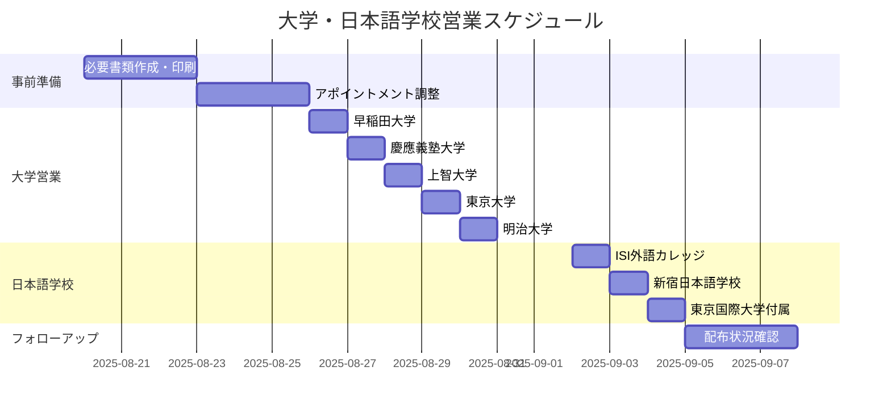

# 大学・センター営業戦略ガイド

## 🎯 **事前準備（必須）**

### 1. 必要書類の準備
- **企画書（1ページ版）**: イベント概要・目的・参加メリット
- **会場確認書**: はるみらい施設使用許可書
- **責任者プロフィール**: 運営責任者の経歴・連絡先
- **過去実績**: Meetupでの活動実績（参加者数・フィードバック）
- **保険証明書**: イベント保険加入証明（推奨）

### 2. デザイン素材
- **A4チラシ**: 100-200枚/施設
- **A3ポスター**: 2-5枚/施設
- **デジタル素材**: メール配信用PDF・SNS用画像

## 📞 **アプローチ手順**

### Step 1: 事前調査・連絡先特定
```
ターゲット部署の特定：
• 国際交流センター/国際部
• 学生支援課
• 留学生センター
• キャリアセンター（起業支援）
```

### Step 2: 初回連絡（電話）
**推奨トークスクリプト：**
```
「お忙しい中失礼いたします。○○と申します。
9月15日に晴海で開催する『Japan Innovation Showcase』という
国際交流イベントについてご相談があり、お電話いたしました。

留学生の方々に日本のイノベーションや起業文化を体験していただく
機会として企画しており、チラシの配布にご協力いただけないでしょうか。

詳細はMeetupページでご確認いただけます：
https://www.meetup.com/ja-JP/open-coral-network/

5分程度でご説明させていただけるお時間はございますでしょうか？」
```

### Step 3: アポイントメント設定
- **訪問時間**: 30分以内
- **持参物**: 企画書・チラシサンプル・名刺
- **提案内容**: 配布協力 + 学生への告知協力

## 🏛️ **優先ターゲット施設**

### **Tier 1: 高効果大学（優先度★★★）**

| 大学名 | 担当部署 | 連絡先 | 留学生数 | アプローチ角度 |
|--------|----------|--------|----------|----------------|
| **早稲田大学** | 国際コミュニティセンター | 03-5286-3789 | 5,000名 | 起業家育成プログラム連携 |
| **慶應義塾大学** | 国際センター | 03-5427-1566 | 1,800名 | ビジネス系学部との連携 |
| **上智大学** | 国際関係本部 | 03-3238-3179 | 2,000名 | 国際教養学部学生向け |
| **東京大学** | 国際部 | 03-5841-2367 | 4,000名 | 研究者・院生向けネットワーキング |

### **Tier 2: 日本語学校（効果的）**

| 学校名 | 特徴 | 学生数 | アプローチポイント |
|--------|------|--------|-------------------|
| **ISI外語カレッジ** | ビジネス系コース充実 | 800名 | 就職支援・起業体験 |
| **新宿日本語学校** | 多国籍 | 600名 | 文化交流・ネットワーキング |
| **東京国際大学付属** | 大学進学特化 | 500名 | キャリア形成支援 |

## 💡 **営業トーク例**

### **相手のメリットを強調**
```
「学生の皆様にとって：
✓ 無料で参加できる貴重な体験機会
✓ 日本の起業家・クリエイターとの直接交流
✓ 将来のキャリア形成に役立つネットワーキング
✓ 日本のイノベーション文化の理解促進

貴施設にとって：
✓ 学生への付加価値サービス提供
✓ 地域連携・社会貢献活動の一環
✓ 国際交流促進への貢献」
```

### **懸念への対応**
- **「営利目的では？」** → 「参加費は最低限の運営費のみ。文化交流が主目的」
- **「学生に負担は？」** → 「完全自由参加。強制的な告知は一切いたしません」
- **「継続的な依頼は？」** → 「今回限りの単発イベントです」

## 📋 **訪問チェックリスト**

### **訪問前準備**
- [ ] アポイントメント確定
- [ ] 企画書・チラシサンプル準備
- [ ] 名刺・身分証明書携帯
- [ ] 訪問先の基本情報確認

### **訪問時の重要ポイント**
1. **時間厳守**: 約束時間の5分前到着
2. **資料は簡潔**: A4 1枚で要点をまとめる
3. **学生目線**: 「学生にとってのメリット」を最優先で説明
4. **柔軟性**: 相手の要望に合わせた配布方法を提案

### **配布方法の選択肢**
- **掲示板貼付**: 最も一般的・負担が少ない
- **ラック配置**: 学生が自由に取得
- **メール配信**: デジタル素材提供
- **授業内告知**: 担当教授経由（効果大）

## 📅 **実施スケジュール**



## 📊 **効果測定と改善**

### **記録すべき項目**
- 訪問日時・担当者名・部署
- 対応結果（承諾/拒否/保留）
- 配布予定数・配置場所・期間
- 特記事項・改善点・次回アクション

### **営業結果記録シート**

| 施設名 | 訪問日 | 担当者 | 結果 | 配布数 | 配置場所 | 備考 |
|--------|--------|--------|------|--------|----------|------|
| 早稲田大学 | 8/26 | | | | | |
| 慶應義塾大学 | 8/27 | | | | | |
| 上智大学 | 8/28 | | | | | |
| 東京大学 | 8/29 | | | | | |

### **成功事例の横展開**
成功した施設での配布方法・アプローチを他施設にも適用

## 🎯 **成功確率向上のコツ**

### **効果的なアプローチ戦略**
1. **相手の立場に立つ**: 学生支援という共通目標を強調
2. **具体的な価値提示**: 数値や事例を使って説明
3. **負担軽減**: 最小限の協力で最大効果を提案
4. **感謝の姿勢**: 協力への感謝を前面に出す

### **NGパターンの回避**
- ❌ 一方的な説明に終始
- ❌ 営利目的と誤解される表現
- ❌ 過度な協力要請
- ❌ 学生への強制参加を匂わせる

---

**📞 次のアクション**: 8月20日から準備開始、8月26日から順次訪問実施

**📈 目標成果**: 5大学 + 3日本語学校での配布承諾、計800-1,000枚の効果的配布

---

**関連資料**:
- [メインイベント企画書](./企画書.md)
- [PR戦略・マーケティング戦略](./PR戦略.md)
- [会場詳細：はるみらい](./会場詳細_はるみらい.md)